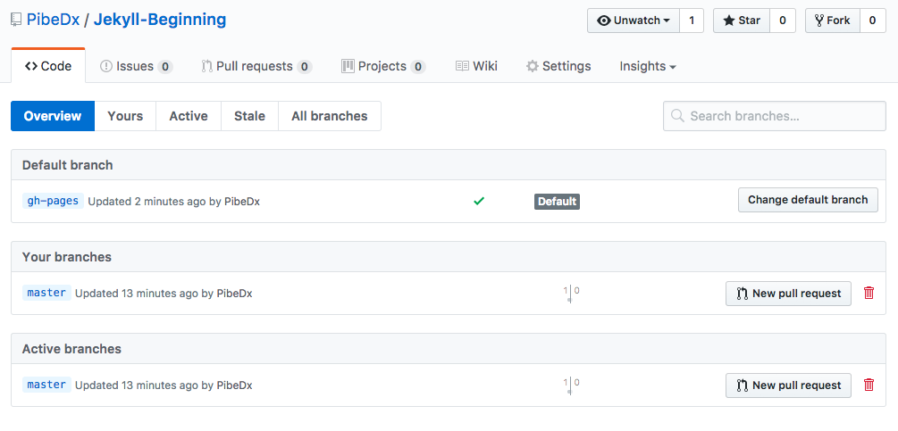
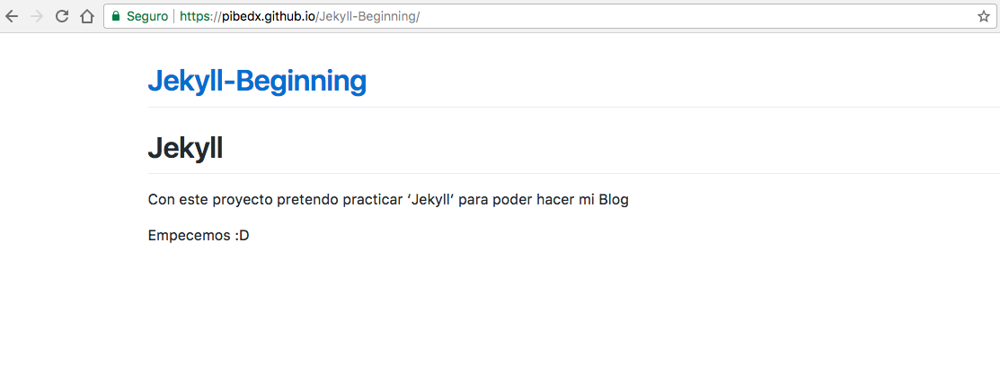
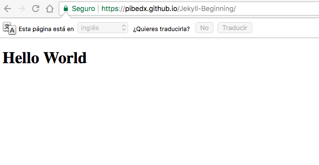

# Creacion de rama gh-pages

Creamos una rama `gh-pages` y nos posicionamos sobre la rama

```
git checkout -b gh-pages
```

Creamos un nuevo `commit` y subimos la llama al repositorio

```
git add -A
git commit -m "add step 1"
git push origin gh-pages
```

Debemos hacer que `gh-pages` sea el branch por default en github



Este seria el resultado:



Ahora agregaremos un `index.html` para que tome esta pagina en vez del README.md, se veria algo asi:



